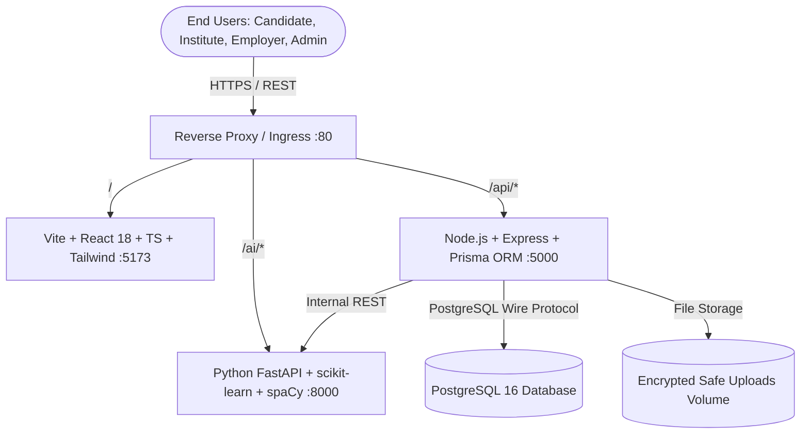
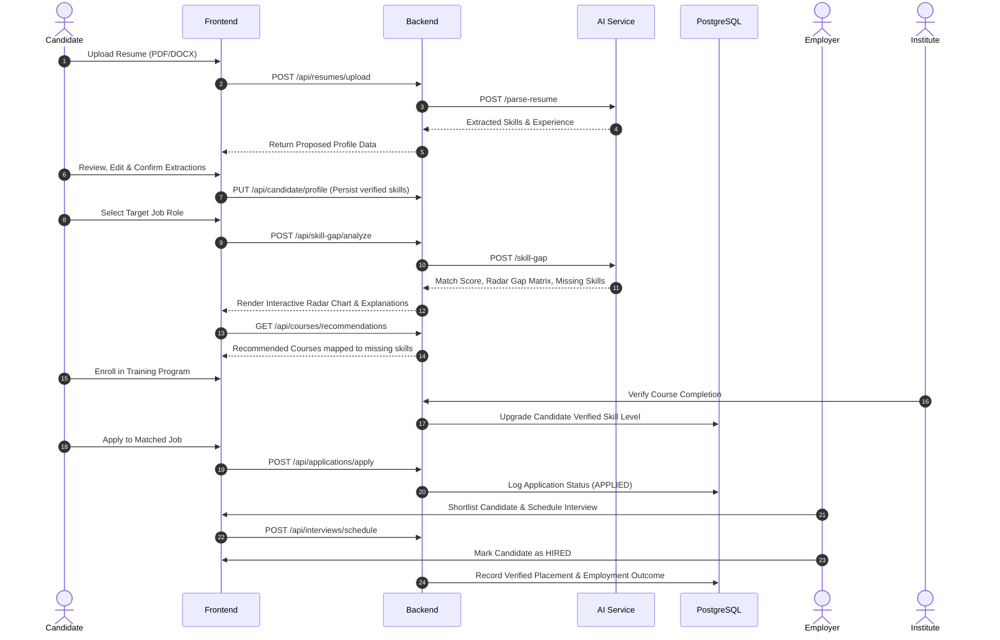

# SkillTrack AI — System Architecture
**Smart India Hackathon 2026 | Problem Statement ID: 26135**  
**Theme:** Skill Development / Employment | **Team:** Code Warriors

---

## 1. High-Level System Architecture

SkillTrack AI is structured as a scalable, modern micro-monorepo comprised of four primary tiers:

---

## 2. Component Breakdown

### 2.1 Frontend (`/frontend`)
- **Framework:** React 18 with TypeScript and Vite bundler
- **Styling:** Tailwind CSS with Government-Ready SaaS design system (Deep Navy `#0b132b`, Brand Blue `#0c87eb`, Slate neutral tones)
- **Routing:** React Router v6 with strict Role-Based Access Control (RBAC) guards
- **Visualizations:** Recharts for Skill-Gap Radar charts, Demand trends, and Conversion funnel analytics
- **State & Networking:** Context API + Axios with automatic JWT bearer token interceptors & refresh handlers

### 2.2 Backend (`/backend`)
- **Runtime:** Node.js 20 LTS with Express.js REST APIs
- **ORM & Data Layer:** Prisma ORM connecting to PostgreSQL
- **Security & Middleware:**
  - `helmet` security headers
  - `cors` origin whitelisting
  - `express-rate-limit` DDoS and brute-force mitigation
  - `bcryptjs` password hashing (cost factor 12)
  - `jsonwebtoken` for stateless, signed access & refresh tokens
  - `zod` schema-based request validation
  - Centralized audit logging middleware

### 2.3 AI / ML Service (`/ai-service`)
- **Runtime:** Python 3.11 with FastAPI and Uvicorn
- **NLP & Parsing:** `spaCy` NLP with custom entity ruler and phrase matcher for multi-word skill taxonomy extraction (`pdfplumber` & `python-docx` for parsing)
- **Matching & Similarity:**
  - Hybrid matching engine: Rule-based skill overlap with proficiency weights (transparent and explainable)
  - TF-IDF Vectorization with Cosine Similarity for semantic context matching between candidate resumes and job role specifications
- **Recommendation Engines:**
  - Job Matcher with per-factor explanation (Skill overlap 50%, Experience fit 20%, Qualification 15%, Location/Preferences 15%)
  - Course Matcher addressing detected missing skill gaps ranked by impact and duration fit

### 2.4 Database (`/backend/prisma`)
- **Database Engine:** PostgreSQL 16
- **Schema Management:** Prisma Schema (`schema.prisma`) with declarative migrations
- **Integrity & Constraints:**
  - Foreign key cascades and set null safeguards
  - Custom Enums for strict status state-machines
  - Composite unique indexes preventing duplicate enrollments or applications
  - Status history logging for the entire placement lifecycle

---

## 3. End-to-End Workflow Pipeline

